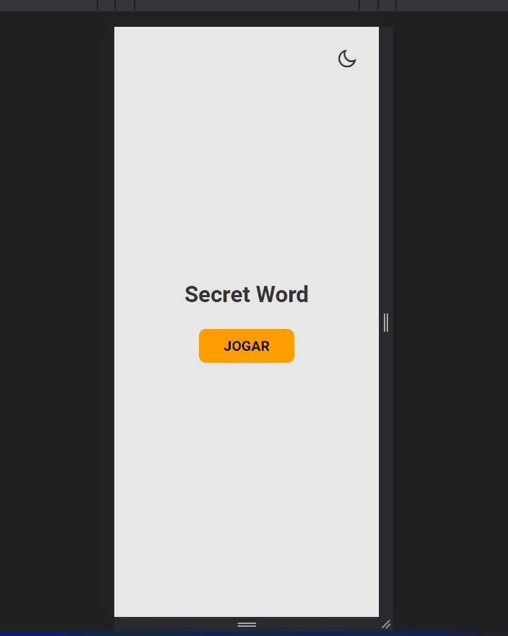

# secret-word



> O projeto é um jogo onde o usuário deve acertar as letras que compõem a palavra. Esse projeto foi desenvolvido com <strong>REACTJS através do Vite</strong> no curso do Matheus Battisti, porém foram adicionadas algumas melhorias como seleção de tema (dark ou light), pontuação com localstorage e tratamento de letras especiais (Ex: Ç, Á).

### Ajustes e melhorias

- [x] Design
- [x] Resposividade
- [x] Funcionalidades

## ⚙️ Pré-requisitos

- Node
- Git

## 🚀 Baixando

Para baixar, siga estas etapas:

Linux, macOS ou Windows:

```
git clone https://github.com/devCleidison/secret-word.git
```

ou baixe o arquivo compactado diretamente pelo link:

```
https://codeload.github.com/devCleidison/secret-word/zip/refs/heads/main
```

## ☕ Instalando as dependências

```
yarn ou npm
```

## 🚀 Executando

```
yarn dev ou npm dev
```

## 🚀 Quer testar antes?

- [Clique aqui!](https://devcleidison-secret-word.netlify.app/)

## 📫 Quer contribuir?

Para contribuir, siga estas etapas:

1. Bifurque este repositório.
2. Crie um branch: `git checkout -b <nome_branch>`.
3. Faça suas alterações e confirme-as: `git commit -m '<mensagem_commit>'`
4. Envie para o branch original: `git push origin <nome_do_projeto> / <local>`
5. Crie a solicitação de pull.

Como alternativa, consulte a documentação do GitHub em [como criar uma solicitação pull](https://help.github.com/en/github/collaborating-with-issues-and-pull-requests/creating-a-pull-request).

[⬆ Voltar ao topo](#secret-word)<br>
